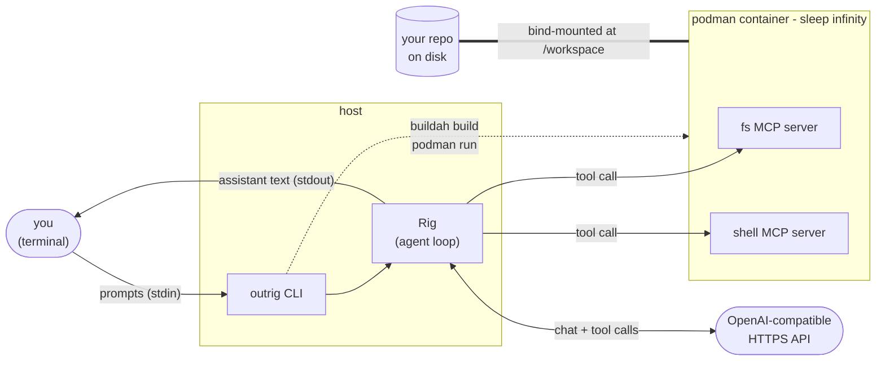

# Introduction

`outrig` is a command-line tool for running LLM agents against your repository, where every tool
the agent invokes runs inside a [podman](https://podman.io)-managed container that you describe
with a `Dockerfile`. You stay in control of the environment the agent gets to play in: which
language toolchains are available, which MCP servers are wired up, what the agent's view of the
filesystem looks like.

## The problem

Modern coding agents are good at running tool calls -- reading files, editing them, executing shell
commands, hitting external APIs. But "running tool calls" on a developer's laptop means the agent
can do anything the developer can: delete files outside the project, push to remote branches, talk
to anything on the network. Most agent harnesses respond to this by gating each tool call behind a
human-approval prompt. That works, but it defeats the point of letting the agent *work* -- every
prompt is a context switch back to the human.

outrig takes a different trade. Instead of approving each call, you set up a sandbox once: a
Dockerfile, a config file, a network policy. The agent then operates autonomously inside that
sandbox. The blast radius of a wrong tool call is bounded by the container.

## How it fits together

- **outrig** is a Rust CLI. You run it from a shell inside your repo.
- **Rig** ([rig-core](https://crates.io/crates/rig-core)) drives the agent loop: it talks to your
  configured LLM provider, decides when to call tools, feeds tool results back to the model.
- **podman** is the container runtime. We use [buildah](https://buildah.io) to build the image from
  your `Dockerfile` (buildah and podman share image storage, so anything buildah builds, podman can
  run).
- **MCP servers** ([Model Context Protocol](https://modelcontextprotocol.io/)) are the actual tools
  -- filesystem access, shell execution, whatever you install in your container. outrig speaks
  JSON-RPC to each one over `podman exec`'d stdio and exposes them to Rig as dynamic tools.

## What outrig is not

- Not a hosted service. It's a CLI you run locally.
- Not an LLM. You bring the model -- any OpenAI-compatible endpoint, plus whatever providers Rig
  adds.
- Not opinionated about *what* the agent can do. You write the Dockerfile, you pick the MCP
  servers. outrig is just the harness.
- Not a replacement for human-in-the-loop review of *outcomes*. The agent has full filesystem
  access to the workspace you mount; you review what it did via `git diff` after the session ends,
  not via approval prompts during it.

## What's next

- [Quickstart](quickstart.md) -- write your first Dockerfile + config and run an agent in five
  minutes.
- [Concepts -> Workspace](concepts/workspace.md) -- what the agent can and can't reach on your
  machine.
- [Concepts -> Providers, Models, and Agents](concepts/llm-providers.md) -- how to point outrig
  at a model.
