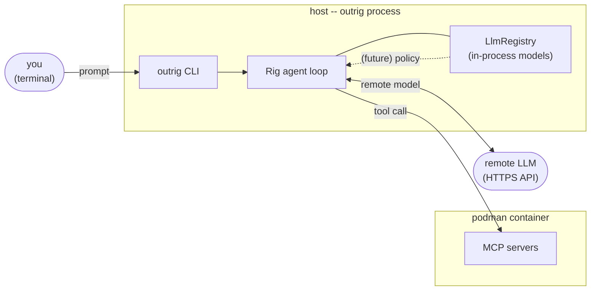

# In-process LLMs

An **in-process LLM provider** runs the model in the same address space as the outrig CLI
itself, backed by the [`mistralrs`](https://crates.io/crates/mistralrs) crate. The model
weights load into outrig's process; questions never cross a socket, never get serialized into
JSON, never reach a network.

This is a feature you opt into at build time and at config time. Most users running outrig
against a hosted API never need it.

## Why you might want this

Three downstream features (none of which ship with the in-process provider itself) need an
LLM whose *input* must not leave the host:

- **Network egress filter.** A future CONNECT proxy in front of the container will ask "does
  this outbound payload match what the user told the agent to do?" Asking a remote LLM that
  question is self-defeating -- the payload becomes the question.
- **Tool-use filter.** A wrapper around the agent loop will ask "is this tool call, with
  these arguments, consistent with the agent's stated objective?" The arguments may include
  source code, secrets, or session context the user does not want round-tripped to a third
  party.
- **Prompt-injection scanner.** A pre-filter on incoming tool results will ask "does this
  content appear to contain instructions targeting the agent?" Tool results from untrusted
  sources are exactly what you don't want re-emitted to a remote LLM.

In all three cases the *answer* is small (often a single token, sometimes a structured
verdict). It's the *question* that's sensitive. The right placement for the model is local
enough that the question never crosses a process boundary.

> **TODO: Incomplete** -- the egress filter, tool-use filter, and prompt-injection scanner
> are downstream features. v0 ships the in-process provider as plumbing only; nothing in
> outrig calls it automatically yet.

## Why in-process and not localhost

A local LLM server (Ollama on `127.0.0.1`, for instance) puts the model in another process
under the same user. That's not the same trust boundary as in-process:

- **Marshaling.** Sensitive payloads still cross a socket and get serialized into JSON. Any
  process with the right uid (or `ptrace`) can observe the traffic. "Did this question ever
  get serialized somewhere I can't see?" becomes harder to answer.
- **Lifecycle skew.** A separate daemon has its own start/stop, its own logging, its own
  crash recovery. The trust property "this question was answered locally" is weaker when it
  depends on another process's configuration.

In-process keeps the question, the model weights, and the answer in one address space owned
by outrig itself. The boundary is the outrig process, not "the host machine."

If you want the convenience of a localhost server (Ollama, vLLM, etc.) and don't need the
in-process trust property, the OpenAI-compatible
[`style = "openai"`](llm-providers.md#pointing-at-openai-compatible-endpoints) provider with
a `localhost` `base-url` is the right tool. Use the in-process provider only when content
locality is itself the requirement.

## Configuring an in-process provider

A `style = "mistralrs"` provider has no `base-url` and no `api-key`. The provider table
is bare -- it just declares "this is the in-process runtime." Each set of weights goes
on its own `[models.<name>]` row referencing the provider, so one `mistralrs` provider
can back many models. You tell outrig where to find each model's weights either by
HuggingFace repo id (outrig downloads it) or by local path (you place it on disk).

```toml
[providers.local]
style = "mistralrs"
```

### From HuggingFace (recommended)

```toml
[models.phi3-fast]
provider   = "local"
model-id   = "microsoft/Phi-3-mini-4k-instruct-gguf"
model-file = "Phi-3-mini-4k-instruct-q4.gguf"   # required when the repo has multiple GGUFs
# revision      = "main"   # optional; pin a git ref for reproducibility
# context-length = 4096    # optional; override the model's default context window
# device         = "cuda"  # optional; defaults to "cpu"
```

On first use, outrig downloads the named GGUF file from `https://huggingface.co/<model-id>`
and caches it under `<XDG_CACHE_HOME>/outrig/models/` (override with the top-level
`model-cache-root` config key; see [Reference -> Config](../reference/config.md)). Subsequent
runs reuse the cached file.

`model-file` is optional only when the repo ships exactly one `.gguf`. Repos that publish
several quantizations (`-q4`, `-q5_k_m`, `-f16`, etc.) require an explicit pick.

### From a local path

```toml
[models.llama-local]
provider   = "local"
model-path = "/var/cache/outrig/models/llama-3-8b-instruct.q4.gguf"
# context-length = 4096    # optional
# device         = "metal" # optional; defaults to "cpu"
```

Use this when you want to pre-stage the model yourself -- in CI, in air-gapped environments,
or when you want to manage the cache directory by hand. `model-path` may be absolute or
relative to the repo root.

### One or the other, not both

Exactly one of `model-id` and `model-path` is required on each mistralrs model.
Specifying both, or neither, is a config error. `model-file` and `revision` are only
meaningful with `model-id`. The `[models.<name>].identifier` field that openai-style
models use is not allowed on mistralrs models -- the weights *are* the model.

### GGUF only

v0 supports GGUF model files only. `mistralrs` can also load raw HuggingFace `safetensors`
directories, but outrig doesn't expose that path -- if you need it, file an issue.

### Device selection

By default, mistralrs models run on CPU:

```toml
device = "cpu"
```

GPU builds can opt into CUDA or Metal per model:

```toml
device = "cuda"    # CUDA device 0
device = "cuda:1"  # CUDA device 1 as the base device
device = "metal"   # Metal device 0
```

`cuda` requires a binary built with `--features "local-llm cuda"`; `metal` requires
`--features "local-llm metal"`. A config that asks for an unavailable backend fails
loudly when the agent is resolved, with a rebuild hint. Enabling `cuda` or `metal`
without `local-llm` emits a build warning and has no effect. outrig does not silently
fall back to CPU, because that would hide the performance and policy properties the
user asked for.

Metal is only usable on macOS targets, and outrig does not build for one today: its
container plumbing calls `setns(2)` and `CLONE_NEW*` unconditionally, so
`crates/outrig/src/lib.rs` rejects a non-Linux target outright. That makes `metal`
unreachable in practice until `plan/next/macos-host-support.md` lands. It stays declared so
the feature matrix and the macOS-only dependency block in `crates/outrig-cli/Cargo.toml` do
not rot: non-macOS builds can compile with it for that coverage, but instantiating a Metal
device fails with a platform error.

For one-off runs, `outrig run --device cuda`, `--device cuda:1`, `--device metal`, or
`--device cpu` overrides the model's configured `device` without editing the config file.
The override only applies to `style = "mistralrs"` models.

outrig still passes mistralrs's automatic device map through to the loader. For
`cuda:N`, `N` is the selected base device; mistralrs may use other same-kind devices if
its auto mapper decides the model needs them. Explicit sharding controls and ROCm/AMD GPU
support are not part of this surface yet.

### Build flag and the "still parses" rule

The in-process backend is gated behind a Cargo feature:

```
cargo build --features local-llm
cargo build --features "local-llm cuda"
cargo build --features "local-llm metal"
```

The `metal` line is listed for completeness. It compiles anywhere, but the device it selects
needs a macOS target that outrig does not build for yet -- see above.

A build *without* `--features local-llm` still **recognizes** `style = "mistralrs"` in
config files. Parsing succeeds, cross-reference validation succeeds, `outrig` will load and
display configs that contain `mistralrs`-style providers and models without complaint.
The error fires only when an agent actually tries to use one of those models -- at
agent-resolve time, when outrig walks `agent -> model -> provider` and tries to
instantiate a client. The message names the missing feature flag so the fix ("rebuild
with `--features local-llm`", `--features cuda`, or `--features metal`) is one shot.

The point of this design is portability: a repo's `.agents/outrig/config.toml` can declare
both an OpenAI-style provider and a `mistralrs`-style provider, and the same checked-in
config works for teammates whether or not they built with the feature on. The cost --
"using a `mistralrs` model on a build that doesn't support it errors out at run time" --
is paid only by users who actually try to use it.

### First-use download stalls

The first request to a `model-id` provider blocks while the GGUF downloads. Models are
typically a few hundred megabytes to a few gigabytes; on a residential connection this can
take minutes. There is no progress UI in v0; the run looks idle until the download
completes. Pre-warm by running outrig once with a short prompt before relying on it for
real work, or use the local-path form and place the file yourself.

### Decode streaming

After the model is loaded, assistant replies stream to stdout while `mistralrs` decodes them.
This matters most on CPU, where a long local reply can take minutes if you wait for the full
completion. Tool-call traces and prompts remain on stderr, so `outrig run > reply.txt` still
captures only assistant text.

## Model lifecycle

Loading a GGUF is expensive (seconds, sometimes tens of seconds, sometimes gigabytes of
RAM). outrig holds one loaded engine per *model name* for the lifetime of the process:

- The first request to a `mistralrs` model triggers the load.
- Subsequent requests against the same model reuse the loaded engine.
- Two agents that point at the same `[models.<name>]` block share one in-memory copy.
- Two `[models.<name>]` rows that share a provider but specify different weight specs
  load distinct engines -- the cache key is the model name, not the provider.
- The engine is dropped on outrig process exit. There's no eviction in v0 -- one engine
  per model, no multi-tenant pressure.

The registry lives in the host outrig process, never inside the sandboxed container.
Loading the model in the container would defeat the trust property: the container is the
thing being filtered.



## What this enables (sketch)

The downstream features named under "Why you might want this" will share a small
one-shot policy API:

```rust
pub struct PolicyEngine { /* ... */ }

impl PolicyEngine {
    /// Ask a yes/no policy question; returns the verdict.
    pub async fn classify_yes_no(&self, question: &str) -> Result<bool>;

    /// Ask a structured question; returns a JSON value validated against the schema.
    pub async fn classify_json(
        &self,
        question: &str,
        schema: &serde_json::Value,
    ) -> Result<serde_json::Value>;
}
```

The implementation will lean on `mistralrs`'s constrained-JSON decoding so the returned
value is well-formed by construction. The point of mentioning this here, before any of
it ships, is so the "what is this provider *for*?" question has a concrete answer.

## See also

- [Providers, Models, and Agents](llm-providers.md) -- the three-layer LLM config; the
  in-process provider plugs into the same `[providers.<name>]` slot as a remote one.
- [Reference -> Config](../reference/config.md) -- field-level schema for the bare
  `style = "mistralrs"` provider, the matching mistralrs `[models.<name>]` rows, and
  the top-level `model-cache-root` key.
- [Workspace](workspace.md) -- the eventual egress filter is the headline consumer of this
  provider.
