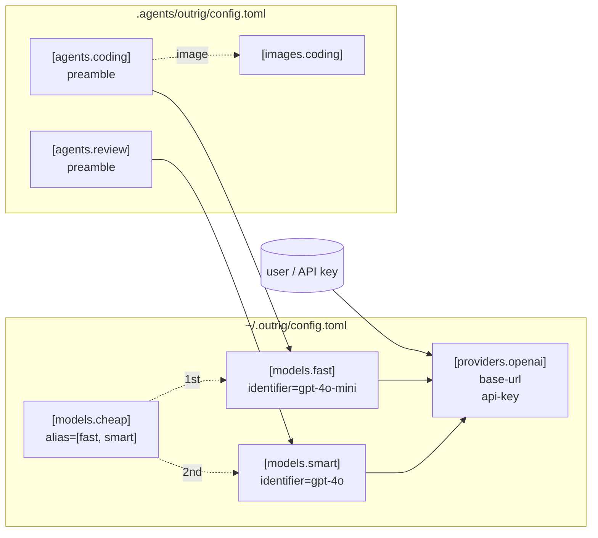

# Providers, Models, and Agents

outrig delegates LLM calls to the [Rig](https://crates.io/crates/rig-core) crate, but configures
the LLM stack in three layers so the same providers and models can be reused across many repos
without copy-pasting:

- **Provider** -- where to talk to (`base-url`, `api-key`, wire format).
- **Model** -- either a named identifier living on one provider (e.g. `gpt-4o-mini` on
  `openai`), or an **alias** naming one or more other models.
- **Agent** -- a runnable unit: model + system preamble (+ optional default image).

Most users keep providers and models in the **global** config (`~/.outrig/config.toml`) since
those depend on the user's accounts and preferences. Agents typically live in the **repo** config
because their preambles and image choices are project-specific.



## `[providers.<name>]`

A provider is a wire-format + endpoint + API key.

```toml
[providers.openai]
style    = "openai"
base-url = "https://api.openai.com/v1"
api-key  = "${OPENAI_API_KEY}"
```

`style` is the protocol. v0 wires `"openai"` for any OpenAI-compatible endpoint -- a model
served on your own machine included, see [Local models](#local-models) -- and `"anthropic"`
for Anthropic's native Messages API (see
[Native Anthropic](#native-anthropic-style--anthropic) below). `base-url` is the HTTPS
endpoint. `api-key` **must** be the `${ENV_VAR}` form -- outrig resolves it at run time,
never reads a key from disk. See
[Reference -> Config](../reference/config.md#api-key-syntax) for the exact rules.

You can declare as many providers as you want -- one per account, one per local Ollama install,
one per OpenAI-compatible aggregator. Names you pick (e.g. `openai`, `local-ollama`,
`work-account`) become labels you reference from models.

## `[models.<name>]`

A model entry does one of two things: it picks a specific identifier on a specific provider, or
it aliases one or more other models.

```toml
[models.fast]
provider   = "openai"
identifier = "gpt-4o-mini"

[models.smart]
provider   = "openai"
identifier = "gpt-4o"
```

`provider` references one of the names you defined under `[providers.<name>]`. `identifier` is
whatever string the provider expects in its API request's `model` field.

The model layer exists so that agents can refer to a stable name (`fast`, `smart`) and swap the
underlying API model without touching every agent. If OpenAI renames a model, you edit one
identifier; every agent using that name picks up the change.

### Aliases

That hop is spent on the wire identifier, which leaves two things it cannot express: a name for a
*name*, and a name for a *set of equivalents*. An `alias` entry covers both.

```toml
# A name for a name. `opus-5` stays pinned for reproducing a result while
# `opus` floats to whatever you consider current.
[models.opus]
alias = "opus-5"

# A name for a set of equivalents: the same weights sold by three vendors,
# in preference order.
[models.smart]
alias = ["opus-5-bedrock", "opus-5-anthropic", "opus-5-azure"]
```

An alias is a model. It sits in the same table, and anything that takes a model name takes it:
`--model`, `default-model`, `[agents.<name>].model`, and a subagent's `model` argument. Aliases
may name aliases; the graph flattens depth-first in config order, keeping the first occurrence of
a repeated name. A cycle is rejected when the config loads.

An entry sets `alias` **or** the provider-shape fields, never both. See
[Reference -> config](../reference/config.md) for the full rules.

#### Which candidate gets picked

When an alias names several models, outrig picks the first one **this build can actually reach**:
its provider is defined, its style is one the binary has a client for, and its `api-key` variable
is set and non-empty. The choice is made once, when the session starts, and the banner prints the
hop it took:

```text
[outrig] agent:             coding (model: smart -> opus-5-anthropic / provider: anthropic / ...)
```

That is what lets one committed config serve a laptop with `ANTHROPIC_API_KEY` set and a CI runner
holding a Bedrock role, without editing `default-model` per machine or keeping divergent configs.

Be clear about what this choice is. Building a remote client performs no network I/O, so
selection answers **"am I configured for this"** and not **"is this endpoint up"**. If every
candidate is unreachable, the session fails at startup naming each one and why it was skipped.

Which endpoint is *working* is settled at runtime instead, by failover -- see
[Failover between candidates](#failover-between-candidates).

#### Failover between candidates

Selection picks a candidate before the session starts, which cannot know that a vendor will
rate-limit an hour later. So when an alias names more than one candidate, the order is also a
runtime fallback: a model call that fails against candidate one is retried against candidate two,
and outrig says so as it happens.

```text
[outrig] model opus-5-bedrock failed (HTTP 429); trying opus-5-anthropic
```

A move happens when a candidate's own retry loop has given up -- so everything under
[Transient failures](#transient-failures) is tried against that endpoint *first*, and failover is
what happens after. It also covers failures no retry would fix: a revoked key answers `401`, which
is final for that vendor but says nothing about the next one, so the chain tries it rather than
ending the session.

When every candidate has failed, what happens next depends on *why*. The message names each
candidate with its own reason either way:

* **At least one failed recoverably** -- a rate limit, an unreachable host, a response that could
  not be used -- and the **turn** ends. Nothing was appended to the history, so sending the prompt
  again retries it. One vendor rate-limiting while another's key is revoked lands here too: the
  rate limit is the reason that can lift on its own, so it is worth waiting out.
* **Every one was terminal** -- a revoked key answering `401` at all three vendors, say -- and the
  **session** ends, exactly as that failure ends it for a single model. No resend can satisfy a
  prompt whose credentials are refused everywhere, and advising one would loop forever.

Two properties worth knowing:

* **The whole chain is bounded by one `retry-budget-secs`, not one per candidate.** Three
  candidates at the ten-minute default is a half-hour turn against a total outage, most of it spent
  on endpoints already known to be down, so the budget is shared rather than repeated. The value
  is the one on the **first selectable candidate's** provider; `retry-budget-secs` on any
  later candidate's provider is not consulted. A chain spanning providers that disagree has no
  single right answer, and the head of a preference order is the defensible one -- so a `0` there
  disables retries for every candidate, and reordering the alias can change which budget governs.
* **Every model call starts again at the head of the list.** The order is a preference, so one
  rate-limit window does not demote candidate one for the rest of the session.

A move happens *between* model calls, never around a whole turn, so tool calls the turn already
ran are not re-executed -- a turn that fails on its fifth model call has already run the tool calls
from the first four, and those stay done.

The cost is that one reply can be half one model's work. That is why a move prints, and why the
banner lists the fallbacks a session may reach before it starts.

## `[agents.<name>]`

An agent ties a model to a system preamble and (optionally) a default image. Agents are
optional: `outrig run` with neither `--agent` nor `default-agent` runs the model directly,
with no preamble and no agent-level knobs.

```toml
[agents.coding]
# model omitted -> falls back to top-level default-model
image       = "coding"
preamble    = "You are a careful coding assistant. Repo is at /workspace."
temperature = 0.2
tool-call-max = 300
tool-result-max = 1048576

[agents.review]
model    = "smart"      # explicit override of default-model
preamble = "You are a meticulous code reviewer. Be specific about line numbers."
```

`model` is optional. If set, it must reference one of the names you defined under
`[models.<name>]`; if omitted, the agent inherits the top-level `default-model` (typically
declared in `~/.outrig/config.toml`). `image` is optional too: if set, `outrig run --agent
<name>` defaults to that image-config. `preamble` is the system prompt the agent operates
under -- the place to encode role, scope, voice. It is optional as well: an agent with no
`preamble` runs with no system prompt.

`temperature` and `max-tokens` live on the agent because the same underlying model is often used
with different sampling for different tasks (e.g. low temperature for code, higher for
brainstorming). `max-tokens` may also be set on the model, which covers every agent pointed at
it; the agent's value wins where both are set. That matters for Anthropic models, whose API
requires a ceiling on every request -- see [Native Anthropic](#native-anthropic-style--anthropic).

`tool-call-max` also lives on the agent when a role needs longer tool loops. If unset, the agent
uses the top-level `tool-call-max`, then the compiled-in default of `50`. The max is per user
turn, so typing a follow-up prompt starts a fresh count while keeping conversation history.
`tool-result-max` works the same way for oversized MCP output: an agent can inherit the
top-level max or set its own byte max when a role regularly reads larger files or logs.

### `default-model` at the top level

Most users have one preferred model and reuse it across repos. Set it once globally:

```toml
# ~/.outrig/config.toml
default-model = "fast"
```

Now any agent that omits `model` picks it up automatically. Per-repo overrides still work --
write `default-model = "smart"` at the top of a repo config and that repo's agents fall back to
`"smart"` instead. Per-agent overrides still work too: `agents.<a>.model = "smart"` wins
over both defaults.

## Pointing at OpenAI-compatible endpoints

Anything that speaks the OpenAI Chat Completions wire format works as a `style = "openai"`
provider:

```toml
[providers.together]
style    = "openai"
base-url = "https://api.together.xyz/v1"
api-key  = "${TOGETHER_API_KEY}"

[providers.openrouter]
style    = "openai"
base-url = "https://openrouter.ai/api/v1"
api-key  = "${OPENROUTER_API_KEY}"

[providers.local-ollama]
style    = "openai"
base-url = "http://localhost:11434/v1"
api-key  = "${OLLAMA_API_KEY}"   # set to anything; some servers ignore the header
```

```toml
[models.tg-llama]
provider   = "together"
identifier = "meta-llama/Llama-3.3-70B-Instruct-Turbo"

[models.or-claude]
provider   = "openrouter"
identifier = "anthropic/claude-sonnet-4-6"
```

The agent loop is unchanged -- it's still tool calls in OpenAI's format, just routed somewhere
else.

### Local models

A model running on your own machine is reached the same way: serve it with a local server that
speaks the OpenAI wire format, and point a `style = "openai"` provider at its `localhost`
`base-url`. Start the model however that tool wants -- note the tool-calling flags, which
outrig's agent loop needs and none of these servers turn on by default:

```sh
ollama serve                 # then: ollama pull qwen3:4b
# or: vllm serve Qwen/Qwen3-4B --enable-auto-tool-choice --tool-call-parser hermes
# or: llama-server -m ./qwen3-4b-q4.gguf --port 8080 --jinja
```

```toml
[providers.local]
style    = "openai"
base-url = "http://127.0.0.1:11434/v1"   # Ollama's default; vLLM 8000, llama-server 8080
api-key  = "${OLLAMA_API_KEY}"           # see the note below

[models.local-fast]
provider   = "local"
identifier = "qwen3:4b"                  # whatever name the server serves it under
```

Three wrinkles worth knowing before you hit them:

- **The model must support tool calling.** outrig's loop needs the model to emit tool calls in
  the provider's native format, and not every local model does. Ollama's `phi3` has no `tools`
  capability and rejects outright a request that carries any; vLLM emits no tool calls at all
  without `--enable-auto-tool-choice --tool-call-parser <parser>`; `llama-server` needs
  `--jinja` to apply the template that produces them. Pick a tool-capable model (`qwen3`,
  `llama3.1`, `mistral-nemo`) and pass those flags -- see [Tool calling](#tool-calling) for the
  symptom and a one-shot test. A session with no MCP servers and subagents disabled sends no
  tools at all, so a model without the capability still answers plain prompts there; it just
  cannot run an agent.
- **`api-key` is still required**, and must still use the `"${VAR}"` form -- outrig refuses a
  literal. Local servers generally ignore the value, so export any non-empty placeholder
  (`export OLLAMA_API_KEY=unused`). An unset or empty variable makes the model unselectable,
  which is a deliberate rule and not a bug: see [API keys](#api-keys-are-env-var-only).
- **Device placement is the server's.** GPU selection, layer offload, and quantization are the
  server's own flags (`CUDA_VISIBLE_DEVICES`, `--n-gpu-layers`, and friends); outrig has no
  knob for any of them.

Given a tool-capable model, a local model is a model like any other: the tool loop, subagents,
the tool-call and tool-result limits, and aliases and failover all apply, including naming the
local model as one candidate of an alias beside a hosted one. What a local server does not give
you is isolation from the rest of the machine: each request is serialized and crosses a socket,
however briefly. outrig makes no claim that a question stays inside its own process.

**Coming from `style = "mistralrs"`.** outrig 0.2 could also run a model in its own process,
behind the `local-llm` build feature. That backend was removed in 0.3: a config that still names
`style = "mistralrs"`, sets any of the six weight keys (`model-id`, `model-path`, `model-file`,
`revision`, `context-length`, `device`), or sets the top-level `model-cache-root` fails to parse.
Replace the bare provider and its weight-bearing rows with the pair above. The six keys have no
counterpart on purpose -- the server owns all of them, which is the point of the move. The
`[models.<name>]` key is yours: keep whatever the old row was called and every `model = ...`
reference to it keeps working. Only the row's contents change.

## Native Anthropic (`style = "anthropic"`)

`style = "anthropic"` talks to Anthropic's own Messages API rather than to an
OpenAI-compatible translation of it. Requests go to `{base-url}/v1/messages` and carry the
`x-api-key` header; tools are advertised in Anthropic's `input_schema` shape, the model
answers with `tool_use` blocks, and outrig sends each result back as a `tool_result` block.

```toml
[providers.anthropic]
style    = "anthropic"
base-url = "https://api.anthropic.com"
api-key  = "${ANTHROPIC_API_KEY}"

[models.sonnet]
provider   = "anthropic"
identifier = "claude-sonnet-4-6"
max-tokens = 16384
```

`base-url` is the API root; outrig appends `/v1/messages` itself. Both this endpoint and an
OpenAI-compatible bridge to Claude (the `openrouter` provider above, with an
`anthropic/claude-*` identifier) work, and they are genuinely different paths: the bridge
translates to and from chat-completions on someone else's server, while this one is the
native protocol end to end. Prefer the native style when you hold an Anthropic key.

The one thing it asks of you is `max-tokens`. The Messages API requires an output-token
ceiling on every request, so outrig always sends one: yours if you set it on the model
(covering every agent that uses it) or on the agent, otherwise the published ceiling for a
Claude identifier it recognizes, otherwise a fallback of 32768. That last case -- an older
model, a proxy's own naming, or simply a model newer than the pinned rig release -- says so
once on stderr rather than picking a number quietly. Where outrig knows the published
ceiling, it is a cap as well as a default: a larger value of your own is lowered to it,
because the API refuses an over-ceiling request outright. See
[`max-tokens` in the config reference](../reference/config.md#anthropic-models) for the
tiers in full.

Prefer setting the ceiling yourself. The fallback keeps a first run working; it does not
know your model. It errs high deliberately, because a model whose real limit is lower
rejects the request and names that limit, whereas a ceiling set too low truncates replies
mid-sentence with nothing logged.

Everything else is shared with the other remote styles: `request-timeout-secs`,
`retry-budget-secs`, tool-call limits, tool-result truncation, conversation history, and
subagents all behave identically. Turns are non-streaming, as for `openai`.

## Transient failures

A rate limit is not a bug, and neither is a gateway that briefly falls over. Both are
routine on a shared endpoint, so outrig treats them as a wait rather than a failure.

An LLM call that comes back `408`, `425`, `429`, or a `5xx` -- or that answers and then
stops, timing out or losing its connection mid-request -- is retried until it succeeds or
the retry budget runs out. The budget is `retry-budget-secs` on the provider, falling back
to the top-level value and then to ten minutes. Everything else, including the rest of the
`4xx` family, is final on the first try: a `401` will not become a `200` on the second
attempt.

A call that never reaches the endpoint at all is retried on a much shorter leash. A refused
connection, an unresolvable host, or a TLS mismatch usually means the address is wrong
rather than busy, and a wrong address does not come right in ten minutes -- so while no
attempt has got bytes back, the loop is bounded by 30 seconds instead. That is still long
enough to ride out a gateway that is restarting, which is the case worth waiting for. The
short bound is fixed and not configurable, unlike `retry-budget-secs`; it is a property of
how long a restart takes rather than a preference. Setting `retry-budget-secs` below it, or
to `0`, still wins: the loop always takes whichever bound is shorter.

Getting connected is bounded on its own, at ten seconds per attempt, which is what makes
that leash real. A host that answers a connection attempt with silence rather than a refusal
-- a firewall dropping packets, say -- would otherwise hold one attempt open for the whole
`request-timeout-secs` and reach the short bound only afterwards. Note what this does *not*
bound: once connected, waiting for the response is `request-timeout-secs`' business and
nothing else's, because a non-streaming completion answers only when the model has finished,
so a long wait for the first byte is what a long reasoning turn looks like from outside.

Both budgets bound the *retrying* and not an attempt already in flight, which is the same
rule `retry-budget-secs` has always followed. An attempt is never cancelled by the clock
running out; the loop simply declines to start another. So an address that never answers is
settled in about 30 seconds and at worst 40 -- the bound, plus one last connection attempt
that had already begun. A `retry-budget-secs` shorter than ten seconds does not shorten the
connection cap either; it just buys no retries.

The distinction is per request, not per turn, and it latches: once a call has produced a
response, the full budget applies for the rest of that request. A call that connects, gets
a `503`, and then cannot reconnect for its retry is a provider having a bad minute -- not an
address that was never right -- and it keeps the full budget. The practical effect of the
split is that a typo in `base-url` ends the turn in seconds, naming the connection failure,
rather than after ten minutes of retry lines.

When the server says how long to wait, outrig waits that long. This is the reason the retry
lives in outrig's own HTTP client rather than around the model call: a `Retry-After` header
is gone by the time a failure has become a provider error, and a rate limiter's own number is
better than any curve we could guess. Absent one, the wait is exponential backoff from a
second, doubling to a 30-second ceiling and jittered so that several agents sharing an
endpoint do not all come back at the same instant.

A provider can also fail while appearing to succeed: a `200 OK` whose body carries no usable
content. There is nothing for outrig to say and nothing to act on, so that response is
retried too -- twice, then given up on. This retry cannot live in the HTTP client, which sees
a `200` and calls it a success; it wraps the model call instead. It shares the full budget,
so `retry-budget-secs = 0` switches off both layers -- and the short connect bound never
applies here, since a `200 OK` is by definition an endpoint that answered. It is capped by
that count as well: an unusable response comes back in milliseconds, so the budget alone
would spend ten minutes on dozens of tries where a hiccup wants two.

Both retries happen beneath a single model call, which is what keeps them safe. A turn is a
model -> tool -> model loop, and retrying the *turn* would re-run container tool calls that
already happened. Tools run between model calls, never inside one, so replaying either an
HTTP request or a model call replays exactly that and nothing observable.

If the budget or the attempts do run out, the turn ends and the REPL prompts again with the
conversation untouched -- see [`outrig run`](../usage/run.md). The session, and its
containers, stay up.

## Other Rig provider styles

> **TODO: Incomplete** -- v0 wires `"openai"` and `"anthropic"`. The other styles Rig ships
> adapters for (Cohere, Gemini, and friends) are not exposed yet, and neither are the
> Anthropic-specific extras -- prompt caching, citations, and configurable API versions.

## Tool calling

outrig's agent loop relies on the model emitting tool calls in the provider's native format
(e.g. OpenAI's `tool_calls` field). Models that don't support tool calling won't work -- the
agent will appear to "see" tools in its prompt but never invoke them.

If you're using an OpenAI-compatible endpoint, verify the underlying model supports
tool/function calling before pointing outrig at it. A quick test: run a one-shot prompt asking
the model to "list files in /workspace" and watch for `[outrig] tool call: fs__list_directory(...)`
on stderr. No tool-call line means no tool calling.

## API keys are env-var-only

`api-key = "${VAR}"` is the **only** accepted form for the API key. outrig refuses to load any
other value -- a literal key, a missing `${...}` wrapper, anything. This guarantees:

- Configs are safe to commit to source control.
- Keys never end up in `outrig logs` output, in tracing diagnostics, or in session metadata on
  disk.
- Rotating a key is a shell change, not a file edit.

Different shells (different accounts, different rate limits) just point `api-key` at different
env-var names:

```toml
[providers.cheap]
style    = "openai"
base-url = "https://api.together.xyz/v1"
api-key  = "${TOGETHER_API_KEY}"

[providers.expensive]
style    = "openai"
base-url = "https://api.openai.com/v1"
api-key  = "${OPENAI_API_KEY}"
```

## Where things live: global vs repo

| Layer                 | Global (`~/.outrig/config.toml`) | Repo (`.agents/outrig/config.toml`) |
|-----------------------|----------------------------------|-------------------------------------|
| `[providers.<name>]`  | typical home                     | allowed for repo-only providers     |
| `[models.<name>]`     | typical home (reused names)      | allowed for repo-specific models    |
| `[agents.<name>]`     | rare                             | typical home                        |
| `[workspace]`         | rare (machine-wide paths)        | typical home                        |
| `[images.<name>]`     | rare (reused across repos)       | typical home                        |
| `default-model`       | typical home                     | optional override                   |
| `default-agent`       | rare                             | optional                            |
| `default-image`       | rare                             | required for `outrig run`           |

If a name is defined in both, the repo wins -- override by redefining.

`[workspace]` is the one block that does not merge by name. Its `host-path` and `container-path`
merge per key, so a global `container-path` stays in effect until a repo declares its own, and
`workspace.mounts` from both files are appended rather than replaced -- global entries first. A
relative path in either file resolves against the directory of the file that declared it. See
[Reference -> Config](../reference/config.md#resolution-which-file-wins).

## See also

- [Quickstart](../quickstart.md) -- shows `outrig init` writing the repo config and
  invoking `outrig config init` for the global one.
- [Reference -> Config](../reference/config.md) -- every key in `[providers]`, `[models]`,
  `[agents]`.
- [Rig documentation](https://docs.rs/rig-core) -- what each provider style Rig ships supports.
