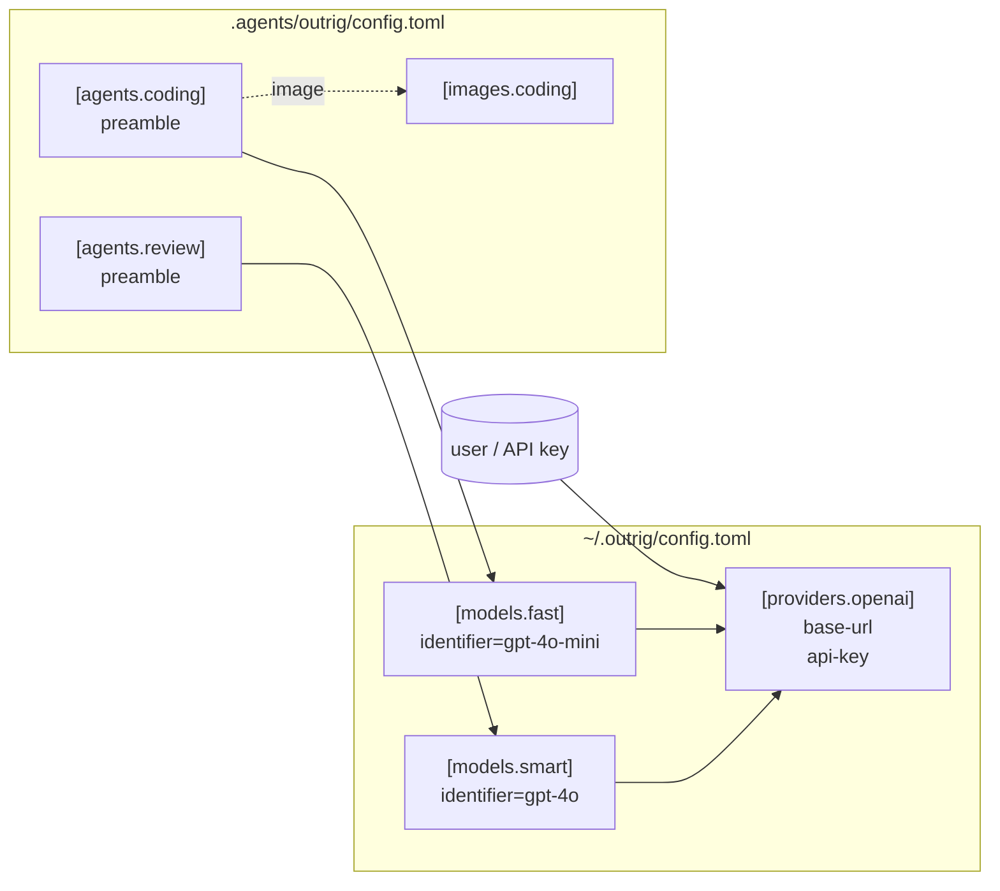

# Providers, Models, and Agents

outrig delegates LLM calls to the [Rig](https://crates.io/crates/rig-core) crate, but configures
the LLM stack in three layers so the same providers and models can be reused across many repos
without copy-pasting:

- **Provider** -- where to talk to (`base-url`, `api-key`, wire format).
- **Model** -- a named identifier living on one provider (e.g. `gpt-4o-mini` on `openai`).
- **Agent** -- a runnable unit: model + system preamble (+ optional default image).

Most users keep providers and models in the **global** config (`~/.outrig/config.toml`) since
those depend on the user's accounts and preferences. Agents typically live in the **repo** config
because their preambles and image choices are project-specific.



## `[providers.<name>]`

A provider is a wire-format + endpoint + API key.

```toml
[providers.openai]
style    = "openai"
base-url = "https://api.openai.com/v1"
api-key  = "${OPENAI_API_KEY}"
```

`style` is the protocol. v0 wires `"openai"` for any OpenAI-compatible endpoint and
`"anthropic"` for Anthropic's native Messages API (see
[Native Anthropic](#native-anthropic-style--anthropic) below), and recognizes `"mistralrs"`
for in-process LLMs (gated behind a Cargo feature -- see
[In-process providers](#in-process-providers-mistralrs) below). `base-url` is the HTTPS
endpoint. `api-key` **must** be the `${ENV_VAR}` form -- outrig resolves it at run time,
never reads a key from disk. See
[Reference -> Config](../reference/config.md#api-key-syntax) for the exact rules.

You can declare as many providers as you want -- one per account, one per local Ollama install,
one per OpenAI-compatible aggregator. Names you pick (e.g. `openai`, `local-ollama`,
`work-account`) become labels you reference from models.

## `[models.<name>]`

A model picks a specific identifier on a specific provider.

```toml
[models.fast]
provider   = "openai"
identifier = "gpt-4o-mini"

[models.smart]
provider   = "openai"
identifier = "gpt-4o"
```

`provider` references one of the names you defined under `[providers.<name>]`. `identifier` is
whatever string the provider expects in its API request's `model` field.

The model layer exists so that agents can refer to a stable name (`fast`, `smart`) and swap the
underlying API model without touching every agent. If OpenAI renames a model, you edit one
identifier; every agent using that name picks up the change.

## `[agents.<name>]`

An agent ties a model to a system preamble and (optionally) a default image.

```toml
[agents.coding]
# model omitted -> falls back to top-level default-model
image       = "coding"
preamble    = "You are a careful coding assistant. Repo is at /workspace."
temperature = 0.2
tool-call-max = 300
tool-result-max = 1048576

[agents.review]
model    = "smart"      # explicit override of default-model
preamble = "You are a meticulous code reviewer. Be specific about line numbers."
```

`model` is optional. If set, it must reference one of the names you defined under
`[models.<name>]`; if omitted, the agent inherits the top-level `default-model` (typically
declared in `~/.outrig/config.toml`). `image` is optional too: if set, `outrig run --agent
<name>` defaults to that image-config. `preamble` is the system prompt the agent operates
under -- the place to encode role, scope, voice.

`temperature` and `max-tokens` live on the agent because the same underlying model is often used
with different sampling for different tasks (e.g. low temperature for code, higher for
brainstorming). `max-tokens` may also be set on the model, which covers every agent pointed at
it; the agent's value wins where both are set. That matters for Anthropic models, whose API
requires a ceiling on every request -- see [Native Anthropic](#native-anthropic-style--anthropic).

`tool-call-max` also lives on the agent when a role needs longer tool loops. If unset, the agent
uses the top-level `tool-call-max`, then the compiled-in default of `50`. The max is per user
turn, so typing a follow-up prompt starts a fresh count while keeping conversation history.
`tool-result-max` works the same way for oversized MCP output: an agent can inherit the
top-level max or set its own byte max when a role regularly reads larger files or logs.

### `default-model` at the top level

Most users have one preferred model and reuse it across repos. Set it once globally:

```toml
# ~/.outrig/config.toml
default-model = "fast"
```

Now any agent that omits `model` picks it up automatically. Per-repo overrides still work --
write `default-model = "smart"` at the top of a repo config and that repo's agents fall back to
`"smart"` instead. Per-agent overrides still work too: `agents.<a>.model = "smart"` wins
over both defaults.

## Pointing at OpenAI-compatible endpoints

Anything that speaks the OpenAI Chat Completions wire format works as a `style = "openai"`
provider:

```toml
[providers.together]
style    = "openai"
base-url = "https://api.together.xyz/v1"
api-key  = "${TOGETHER_API_KEY}"

[providers.openrouter]
style    = "openai"
base-url = "https://openrouter.ai/api/v1"
api-key  = "${OPENROUTER_API_KEY}"

[providers.local-ollama]
style    = "openai"
base-url = "http://localhost:11434/v1"
api-key  = "${OLLAMA_API_KEY}"   # set to anything; some servers ignore the header
```

```toml
[models.tg-llama]
provider   = "together"
identifier = "meta-llama/Llama-3.3-70B-Instruct-Turbo"

[models.or-claude]
provider   = "openrouter"
identifier = "anthropic/claude-sonnet-4-6"
```

The agent loop is unchanged -- it's still tool calls in OpenAI's format, just routed somewhere
else.

## Native Anthropic (`style = "anthropic"`)

`style = "anthropic"` talks to Anthropic's own Messages API rather than to an
OpenAI-compatible translation of it. Requests go to `{base-url}/v1/messages` and carry the
`x-api-key` header; tools are advertised in Anthropic's `input_schema` shape, the model
answers with `tool_use` blocks, and outrig sends each result back as a `tool_result` block.

```toml
[providers.anthropic]
style    = "anthropic"
base-url = "https://api.anthropic.com"
api-key  = "${ANTHROPIC_API_KEY}"

[models.sonnet]
provider   = "anthropic"
identifier = "claude-sonnet-4-6"
max-tokens = 16384
```

`base-url` is the API root; outrig appends `/v1/messages` itself. Both this endpoint and an
OpenAI-compatible bridge to Claude (the `openrouter` provider above, with an
`anthropic/claude-*` identifier) work, and they are genuinely different paths: the bridge
translates to and from chat-completions on someone else's server, while this one is the
native protocol end to end. Prefer the native style when you hold an Anthropic key.

The one thing it asks of you is `max-tokens`. The Messages API requires an output-token
ceiling on every request, so outrig always sends one: yours if you set it on the model
(covering every agent that uses it) or on the agent, otherwise the published ceiling for a
Claude identifier it recognizes, otherwise a fallback of 32768. That last case -- an older
model, a proxy's own naming, or simply a model newer than the pinned rig release -- says so
once on stderr rather than picking a number quietly.

Prefer setting the ceiling yourself. The fallback keeps a first run working; it does not
know your model. It errs high deliberately, because a model whose real limit is lower
rejects the request and names that limit, whereas a ceiling set too low truncates replies
mid-sentence with nothing logged.

Everything else is shared with the other remote styles: `request-timeout-secs`,
`retry-budget-secs`, tool-call limits, tool-result truncation, conversation history, and
subagents all behave identically. Turns are non-streaming, as for `openai`.

## Transient failures

A rate limit is not a bug, and neither is a gateway that briefly falls over. Both are
routine on a shared endpoint, so outrig treats them as a wait rather than a failure.

An LLM call that comes back `408`, `425`, `429`, or a `5xx` -- or that never comes back at
all, timing out or losing its connection -- is retried until it succeeds or the retry budget
runs out. The budget is `retry-budget-secs` on the provider, falling back to the top-level
value and then to ten minutes. Everything else, including the rest of the `4xx` family, is
final on the first try: a `401` will not become a `200` on the second attempt.

When the server says how long to wait, outrig waits that long. This is the reason the retry
lives in outrig's own HTTP client rather than around the model call: a `Retry-After` header
is gone by the time a failure has become a provider error, and a rate limiter's own number is
better than any curve we could guess. Absent one, the wait is exponential backoff from a
second, doubling to a 30-second ceiling and jittered so that several agents sharing an
endpoint do not all come back at the same instant.

The retry happens beneath a single model call, which is what keeps it safe. A turn is a
model -> tool -> model loop, and retrying the *turn* would re-run container tool calls that
already happened. Retrying one HTTP request replays one HTTP request.

If the budget does run out, the turn ends and the REPL prompts again with the conversation
untouched -- see [`outrig run`](../usage/run.md). The session, and its containers, stay up.

## Other Rig provider styles

> **TODO: Incomplete** -- v0 wires `"openai"` and `"anthropic"`. The other styles Rig ships
> adapters for (Cohere, Gemini, and friends) are not exposed yet, and neither are the
> Anthropic-specific extras -- prompt caching, citations, and configurable API versions.

## In-process providers (`mistralrs`)

An in-process provider runs the model in the outrig process itself, with no socket and no
serialization. The use case is questions whose *content* must not leave the host -- the
eventual egress filter, tool-use filter, and prompt-injection scanner all want this. See
[In-process LLMs](in-process-llm.md) for the full picture.

A `mistralrs` provider table is bare -- it just declares "this is the in-process
runtime." Each set of weights goes on a `[models.<name>]` row referencing the provider:

```toml
[providers.local]
style = "mistralrs"

# Auto-download from HuggingFace on first use:
[models.phi3-fast]
provider   = "local"
model-id   = "microsoft/Phi-3-mini-4k-instruct-gguf"
model-file = "Phi-3-mini-4k-instruct-q4.gguf"

# Or point at a GGUF you placed on disk yourself:
[models.llama-local]
provider   = "local"
model-path = "/var/cache/outrig/models/llama-3-8b-instruct.q4.gguf"
```

The provider takes no `base-url` and no `api-key`. Each mistralrs model must set
exactly one of `model-id` / `model-path`. One provider can back many models.

The backend is gated behind `cargo build --features local-llm`. A build *without* the
feature still parses and validates `style = "mistralrs"` blocks cleanly; the error fires
only when an agent tries to actually use one of those models, with a message that names
the missing feature flag. This keeps configs portable across builds.

For the full schema (including `revision`, `context-length`, and the top-level
`model-cache-root` key) see [Reference -> Config](../reference/config.md). For why this
exists at all -- and why "localhost LLM" isn't the same thing -- see
[In-process LLMs](in-process-llm.md).

## Tool calling

outrig's agent loop relies on the model emitting tool calls in the provider's native format
(e.g. OpenAI's `tool_calls` field). Models that don't support tool calling won't work -- the
agent will appear to "see" tools in its prompt but never invoke them.

If you're using an OpenAI-compatible endpoint, verify the underlying model supports
tool/function calling before pointing outrig at it. A quick test: run a one-shot prompt asking
the model to "list files in /workspace" and watch for `[outrig] tool call: fs__list_directory(...)`
on stderr. No tool-call line means no tool calling.

## API keys are env-var-only

`api-key = "${VAR}"` is the **only** accepted form for the API key. outrig refuses to load any
other value -- a literal key, a missing `${...}` wrapper, anything. This guarantees:

- Configs are safe to commit to source control.
- Keys never end up in `outrig logs` output, in tracing diagnostics, or in session metadata on
  disk.
- Rotating a key is a shell change, not a file edit.

Different shells (different accounts, different rate limits) just point `api-key` at different
env-var names:

```toml
[providers.cheap]
style    = "openai"
base-url = "https://api.together.xyz/v1"
api-key  = "${TOGETHER_API_KEY}"

[providers.expensive]
style    = "openai"
base-url = "https://api.openai.com/v1"
api-key  = "${OPENAI_API_KEY}"
```

## Where things live: global vs repo

| Layer                 | Global (`~/.outrig/config.toml`) | Repo (`.agents/outrig/config.toml`) |
|-----------------------|----------------------------------|-------------------------------------|
| `[providers.<name>]`  | typical home                     | allowed for repo-only providers     |
| `[models.<name>]`     | typical home (reused names)      | allowed for repo-specific models    |
| `[agents.<name>]`     | rare                             | typical home                        |
| `[workspace]`         | --                               | repo only                           |
| `[images.<name>]` | --                               | repo only                           |
| `default-model`       | typical home                     | optional override                   |
| `default-agent`       | rare                             | required for `outrig run`           |
| `default-image`   | rare                             | required for `outrig run`           |

If a name is defined in both, the repo wins -- override by redefining.

## See also

- [Quickstart](../quickstart.md) -- shows `outrig init` writing the repo config and
  invoking `outrig config init` for the global one.
- [Reference -> Config](../reference/config.md) -- every key in `[providers]`, `[models]`,
  `[agents]`.
- [Rig documentation](https://docs.rs/rig-core) -- what each provider style Rig ships supports.
