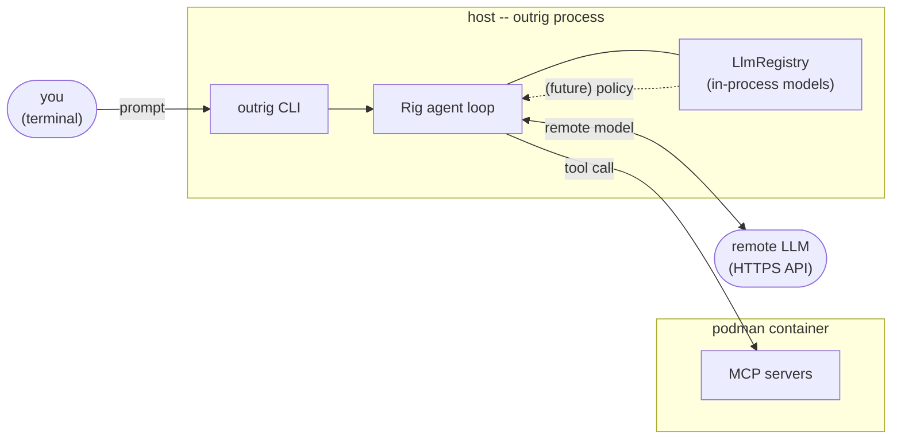

# In-process LLMs (`mistralrs`)

> **TODO: Incomplete** -- this is a preliminary feature design. No implementation has landed
> yet; the task decomposition near the end is the planned breakdown into `plan/todo/` entries.

## Goal

Add an in-process LLM provider so outrig can answer questions whose contents must not leave
the host process. The provider runs the model in the same address space as outrig itself,
backed by the [`mistralrs`](https://crates.io/crates/mistralrs) crate.

This feature is *plumbing*. It does not by itself implement the egress filter, the tool-use
filter, or the prompt-injection scanner that motivated it -- those are downstream features
that consume this provider. Explicit non-goals for v0:

- No CONNECT proxy or per-host allowlist (the egress proxy work, already TODO in
  [`workspace.md`](../../doc/concepts/workspace.md)).
- No `PolicyEngine` API for one-shot constrained queries -- that ships alongside the egress
  proxy.
- No HuggingFace Hub auto-download. Users place model files on disk themselves.
- No GPU device selection. CPU only.

## Use cases

Three downstream features need an LLM and cannot send the question over a network because the
question's *content* is the thing being filtered:

- **Network egress filter.** A future CONNECT proxy fronting the container asks "is this
  outbound payload consistent with the user's intent for this session?" Sending the payload
  to a remote API to find out is self-defeating.
- **Tool-use filter.** A wrapper around the agent loop asks "is this tool call (with these
  arguments) consistent with the agent's stated objective?" The arguments may include source
  code, secrets, or session context the user does not want round-tripped to a third party.
- **Prompt-injection scanner.** A pre-filter on incoming tool results asks "does this content
  appear to contain instructions targeting the agent?" Tool results from untrusted sources
  are exactly what we don't want re-emitted to a remote LLM.

In all three cases the *answer* is small (often a single token, sometimes a structured JSON
verdict) but the *question* is sensitive. The right placement for the model is local enough
that the question never crosses a process boundary.

## Why in-process, not localhost

Running an LLM on `localhost` (an Ollama instance bound to `127.0.0.1`, for example) puts the
model in another process under the same user. Two reasons that's not enough:

- **Marshaling.** Sensitive payloads still cross a socket and get serialized into JSON. Any
  process with the right uid (or `ptrace`) can observe the traffic. The "did this question
  ever get serialized somewhere I can't see?" answer becomes harder to reason about.
- **Lifecycle skew.** A separate process has its own start/stop semantics, its own logging,
  its own crash recovery story. The trust property "this question was answered locally" is
  weaker when it depends on another daemon's configuration.

In-process keeps the question, the model weights, and the answer in one address space owned
by outrig itself. The trust boundary is the outrig process, not "the host machine."

## Backend choice: `mistralrs`

`mistralrs` is the chosen backend. It is a Rust-native inference engine with native support
for GGUF, ISQ-quantized models, tool calling, and JSON-schema-constrained sampling -- the
last of which matters for the eventual policy-oracle path even though that path ships with a
later feature.

### Rejected alternatives

- **`candle`.** HuggingFace's pure-Rust inference primitives. Lower-level than what we need:
  we would own the inference loop, sampler, KV cache, chat templating, and grammar-constrained
  sampling. More code to write and maintain than the policy-oracle use case justifies.
- **`llama-cpp-rs` / `llama_cpp_2`.** Thin FFI wrappers over `llama.cpp`. Pulls a C++ build
  step (cmake + a C++ compiler), and the Rust API is a moving target. Mature GGUF support and
  a well-tested GBNF grammar implementation, but the FFI ergonomics and build dependencies
  weigh against it for a Rust-first project.
- **Ollama (or any localhost server) as a sidecar.** Rejected by the use case itself, as
  explained in "Why in-process, not localhost" above. Worth naming explicitly so it isn't
  reproposed later.

### Verifying the build cost

`mistralrs` has feature-gated paths for BLAS / CUDA / Metal but a CPU-only build does not
require those system dependencies. The implementation task should confirm this against the
current crate version before committing to the feature-flag story below; if the crate's
default features pull a heavy native dep, the feature flag is even more important than this
doc assumes.

## Config schema change

The current `LlmProvider` (`src/config/mod.rs`) is a flat struct keyed on a `style` string:

```rust
#[derive(Deserialize, ...)]
pub struct LlmProvider {
    pub style: String,
    pub base_url: String,
    pub api_key: ApiKeyRef,
    pub request_timeout_secs: Option<u64>,
}
```

An in-process provider has no `base_url` and no `api_key`, so the flat shape no longer fits.
Migrate `LlmProvider` to a `#[serde(tag = "style")]` enum:

```rust
#[derive(Deserialize, ...)]
#[serde(tag = "style", rename_all = "kebab-case")]
pub enum LlmProvider {
    OpenAi {
        base_url: String,
        api_key: ApiKeyRef,
        #[serde(default)]
        request_timeout_secs: Option<u64>,
    },
    Mistralrs {
        model_path: PathBuf,
        #[serde(default)]
        context_length: Option<u32>,
    },
}
```

Existing `style = "openai"` config files round-trip identically; the `style` discriminator
stays at the top level. The migration of call sites (`provider.style == "openai"` checks in
the resolver, etc.) is mechanical: pattern-match on the enum or use a small accessor.

```toml
[providers.openai]
style    = "openai"
base-url = "https://api.openai.com/v1"
api-key  = "${OPENAI_API_KEY}"

[providers.local]
style       = "mistralrs"
model-path  = "/var/cache/outrig/models/Phi-3-mini-4k-instruct-q4.gguf"
# context-length = 4096   # optional
```

### Watch-outs

- **`deny_unknown_fields` plus internally-tagged enums.** Older serde versions reject this
  combination; verify it works under the project's serde 1.0 pin before relying on it. If it
  does not, the workaround is `deny_unknown_fields` on the outer enum only and a hand-rolled
  guard on per-variant fields.
- **Unknown-style error message.** With the enum migration, a typo like `style = "mistral-rs"`
  produces serde's default "unknown variant" message. Pin the message in a regression test so
  future users get something actionable.

### Failure mode when the feature is off

When `cargo build` runs without `--features mistralrs`, a config that contains
`style = "mistralrs"` should fail at config-validate time (the existing
[task 0005](../done/0005-config-merge-validate.md)) with a message naming the feature flag,
not later at agent-resolve time. Validating early lets `outrig run` fail fast and gives the
user a one-shot fix ("rebuild with `--features mistralrs`").

## Cargo feature

A new feature in `Cargo.toml`:

```toml
[features]
default = []
mistralrs = ["dep:mistralrs"]   # exact crate name TBD; see open questions
```

Default off. Two reasons:

- The crate is heavy enough that default users (running outrig against an OpenAI-compatible
  endpoint) should not pay for a build dependency they will not use.
- Future in-process backends (a `candle` variant, perhaps) would be separate features, not
  mode-switches inside one umbrella `in-process-llm` feature. Naming the feature after the
  implementation makes the build matrix legible.

CI runs both `cargo test` (default features off) and `cargo test --features mistralrs`.

## Rig integration

`rig-core 0.36` does not ship a `mistralrs` adapter at the time of writing (verify on
docs.rs at task time). The shim lives in-tree under `src/llm.rs` and implements
`rig::completion::CompletionModel`.

The translation surface:

| Rig                                | mistralrs                              |
|------------------------------------|----------------------------------------|
| `CompletionRequest::preamble`      | system message at the head of the chat |
| `CompletionRequest::chat_history`  | sequence of user/assistant messages    |
| `CompletionRequest::tools`         | tool definitions (JSON schema)         |
| `CompletionRequest::temperature`   | sampler temperature                    |
| `CompletionRequest::max_tokens`    | max output tokens                      |
| `Message::ToolCall { ... }`        | mistralrs tool-call message            |
| `Message::ToolResult { ... }`      | mistralrs tool-response message        |

Tool-call passthrough fidelity is bounded by the underlying GGUF model. v0 promise:

- Models that emit valid tool-call JSON when prompted will work end-to-end through the agent
  loop.
- Models that don't tool-call cleanly are still useful for the policy-oracle path (out of
  scope for this batch), which uses constrained-JSON decoding and does not depend on the
  model's free-form tool-call competence.

## Model lifecycle

Loading a model is expensive (seconds, sometimes tens of seconds, sometimes gigabytes of
RAM). A new `LlmRegistry` in `src/llm.rs` holds one `OnceCell<Arc<MistralrsModel>>` per
provider name. Two agents pointing at the same provider share one loaded model.

The registry lives in the **host outrig process**, not in the sandboxed container. Loading in
the container would defeat the trust property: the container is the thing being filtered.



Lifecycle:

- First request to a `mistralrs` provider triggers a model load.
- Subsequent requests reuse the loaded `Arc<MistralrsModel>`.
- Drop happens on outrig process exit; no eviction in v0 (one model per provider, no
  multi-tenant pressure).

## Policy API preview (out of scope)

Eventually the egress filter, tool-use filter, and prompt-injection scanner will share a
small one-shot API:

```rust
pub struct PolicyEngine { /* ... */ }

impl PolicyEngine {
    /// Ask a yes/no policy question; returns the verdict.
    pub async fn classify_yes_no(&self, question: &str) -> Result<bool>;

    /// Ask a structured question; returns a JSON value validated against the schema.
    pub async fn classify_json(
        &self,
        question: &str,
        schema: &serde_json::Value,
    ) -> Result<serde_json::Value>;
}
```

The implementation will lean on `mistralrs`'s constrained-JSON decoding so the returned value
is well-formed by construction. **This API is not part of the in-process LLM feature.** It
ships alongside the egress proxy in a separate sequence of tasks. Sketching it here makes the
"what is this provider for?" question concrete.

## Documentation surface

Files this feature touches when implementation tasks land:

- **New: `doc/concepts/in-process-llm.md`.** The user-facing version of the Goal, Use cases,
  Why-in-process, Backend choice, Config, Rig integration, and Model lifecycle sections of
  this document, with the planning material stripped out.
- **`doc/concepts/llm-providers.md`.** A new subsection under `## Other Rig provider styles`
  describing `style = "mistralrs"`, with a short config example and a pointer to the new
  concept page.
- **`doc/reference/config.md`.** Schema entries for the new `Mistralrs` provider variant.
- **`doc/concepts/workspace.md`.** A cross-reference from the egress section to the
  in-process LLM page, framing the in-process LLM as an enabler for the future egress filter.

## Task decomposition

Five tasks, each depending only on lower-numbered predecessors. The natural slot is between
[`0012-llm-resolver`](../todo/0012-llm-resolver.md) (which establishes
`resolve_agent` -> `Rig client`) and [`0014-agent-loop`](../todo/0014-agent-loop.md) (which
is easier to land if the agent loop already knows about both provider styles). `/groom-plan`
will assign actual numbers when these are folded into `plan/todo/`.

1. **`LlmProvider` tagged-enum refactor.** Pure refactor; no `mistralrs` code. Migrates the
   struct in `src/config/mod.rs` to `#[serde(tag = "style")]`, updates fixtures and the 0012
   resolver call sites. Adds a regression test for the unknown-style error message.
   *Acceptance:* `cargo test` passes; existing `style = "openai"` fixtures round-trip; a typo
   like `style = "mistral-rs"` fails parsing with a useful message.
   *Depends on:* 0012.

2. **`mistralrs` feature-gated dependency wiring.** Adds the feature in `Cargo.toml`, the
   optional dep, and an empty `#[cfg(feature = "mistralrs")]` module under `src/llm.rs`.
   Updates CI to run both `--no-default-features` and `--features mistralrs`. No runtime
   behavior.
   *Acceptance:* `cargo build` passes in both feature configurations; the CI matrix covers
   both.
   *Depends on:* (1).

3. **Rig `CompletionModel` shim for `mistralrs`.** Writes the adapter, including
   request/response translation and tool-call passthrough where the model supports it. Smoke
   test gated behind `--features mistralrs` *and* an env var
   (`OUTRIG_MISTRALRS_TEST_MODEL=/path/to/file.gguf`) so CI without a model file skips
   cleanly.
   *Acceptance:* with the feature on and the env var set, a one-shot prompt round-trips
   through the shim and returns a non-empty completion.
   *Depends on:* (2).

4. **Provider lazy-load + sharing.** Adds `LlmRegistry` to `src/llm.rs` with
   `OnceCell<Arc<MistralrsModel>>` keyed by provider name. Wires it through the resolver so
   two agents pointing at the same in-process provider share one loaded model.
   *Acceptance:* a unit test confirms two `resolve_agent` calls against the same provider
   return clients backed by the same `Arc`.
   *Depends on:* (3).

5. **Documentation pass.** Adds `doc/concepts/in-process-llm.md`. Updates
   `doc/concepts/llm-providers.md`, `doc/reference/config.md`, and
   `doc/concepts/workspace.md` per "Documentation surface" above. Drops
   `> **TODO: Incomplete**` markers where the surface is now real.
   *Acceptance:* `python3 scripts/audit-doc-style.py doc` passes; mdbook builds clean.
   *Depends on:* (4).

The `PolicyEngine` API and the constrained-JSON decoding path are **not** in this batch.

## Open questions

- **`mistralrs` crate variant and version pin.** The project publishes `mistralrs`,
  `mistralrs-core`, and `mistralrs-server`; the right pick depends on whether we need the
  high-level facade or just the inference primitives. Confirm at task (3) time. The crate is
  pre-1.0; expect a tight version pin and conservative bumps.
- **Device handling in v0.** CPU only with no `device` field, or include the field reserved
  for later (`device = "cpu"` default, `device = "cuda:0"` placeholder)? Including it now
  bloats the v0 surface but avoids a config break later.
- **Model file format.** GGUF only is the minimum; raw HuggingFace `safetensors` directories
  are a `mistralrs` capability that may or may not pull its way in. v0 lean: GGUF only.
- **Failure-mode placement.** The recommendation here is config-validate (task 0005)
  failure when the feature is off but the config asks for `mistralrs`. Confirm the message
  wording and whether 0005 should grow a feature-aware validator hook.
- **Tool-calling promise.** The v0 promise outlined above is "works iff the underlying GGUF
  model emits valid tool-call JSON when prompted." Stricter (e.g., a known-good model list)
  would be safer but harder to maintain.

## Rejected alternatives

- **Flat-struct `LlmProvider` with optional fields.** Pushes "is this combination valid?"
  from serde into hand-rolled validation, weakens error messages, rots as more styles land.
- **Capability-named feature flag (`in-process-llm`).** Future in-process backends would
  each need their own native dep tree; an umbrella flag becomes misleading.
  Implementation-named is more honest.
- **Localhost LLM (Ollama, etc.) as a sidecar.** Rejected by the use case -- see "Why
  in-process, not localhost" above.
- **Loading the model inside the sandboxed container.** The container is the thing being
  filtered; loading the policy oracle there destroys the trust property.
